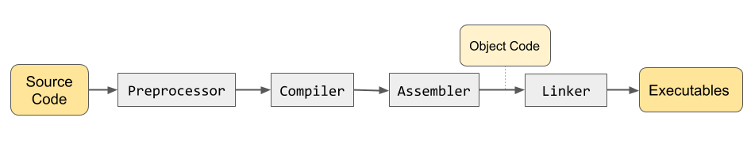

# 第三章：基礎概念

本文首先將介紹程式設計的基本概念，包括從程式碼 -> 執行檔的過程與計算機相關的基本概念，讓我們在開始學習程式開發前能夠擁有足夠的基本概念。

## 程式設計的基本概念

程式設計的基本概念包含程式語言、程式設計工具、程式設計流程、程式設計模式、程式設計原則等。

### 程式語言

程式語言 (programming language) 是一種用來撰寫計算機程式的語言，它是一種文字語法，用來表達計算機程序的各種指令。

目前，最常見的程式語言有 C、C++、Java、Python、JavaScript 等。

### 程式設計流程

程式設計流程 (programming flow) 是指程式設計的各個階段，從程式撰寫、編譯、執行到程式的維護、測試等。

程式設計流程通常包含以下階段：

1. 程式撰寫：用程式語言撰寫程式。
2. 編譯：將程式編譯成機器碼，讓電腦可以執行。
3. 執行：執行程式，讓程式運行。
4. 維護：維護程式，讓程式可以持續運行。
5. 測試：測試程式，確保程式的功能正常運行。

## 從程式碼到執行檔

程式原始碼 (source code) 是用某種程式語言撰寫的文字檔，包含了程式的原始碼。要將原始碼編譯成執行檔 (executable file) 讓電腦可以執行，需要以下步驟：

1. 預處理器 (preprocessor)：處理原始碼中的巨集 (macro) 定義。
2. 編譯器 (compiler)：將原始碼編譯成組合語言 (assembly language)。
3. 組譯器 (assembler)：將組合語言編譯成機器碼。
4. 連結器 (linker)：將各個模組連結成執行檔。
5. 載入器 (loader)：將執行檔載入記憶體，讓程式可以運行。



編譯器 (compiler) 是一種程式，它會將程式碼編譯成組合語言，也就是電腦可以理解的指令。

編譯器的工作流程通常包含以下步驟：

1. 語法分析 (Syntax analysis)：檢查程式碼的語法是否正確。
2. 語意分析 (Semantic analysis)：檢查程式碼的語意是否合理。
3. 程式碼生成 (Code generation)：將程式碼轉換成組合語言。
4. 組譯 (assembler)：將組合語言編譯成機器碼。  

編譯器的輸出通常是一個執行檔，也就是一個可以被電腦執行的檔案。

## 計算機相關的基本概念

計算機(computer)是一個可以執行計算的機器，它由硬體和軟體組成。

硬體(hardware)是指計算機的實體組成，包含主板、記憶體、輸入輸出裝置、網路卡、CPU、GPU、硬碟等。

軟體(software)是指計算機的軟體組成，包含作業系統、應用程式、網頁瀏覽器、資料庫管理系統等。

### 記憶體

記憶體(memory)是一個存放資料的部位，它是一個電腦的重要部位，所有的資料都必須存在記憶體中才能被讀取或修改。

記憶體通常分為兩種：

1. 主記憶體(main memory)：主要存放程式運行時所需的資料。
2. 額外記憶體(secondary memory)：主要存放資料，例如硬碟、光碟等。

### 指令集

指令集 (instruction set) 是指一種電腦可以執行的命令集合。

指令集通常包含以下指令：

1. 輸入輸出指令 (input/output instructions)：用來讀取或輸出資料。
2. 算術指令 (arithmetic instructions)：用來執行數學運算。
3. 控制指令 (control instructions)：用來控制程式的執行流程。
4. 資料轉換指令 (data transfer instructions)：用來讀取或修改資料。
5. 記憶體管理指令 (memory management instructions)：用來管理記憶體。

### 運算元

運算元 (operand) 是指一個計算式中的數值。

運算元通常分為以下類型：

1. 變數 (variable)：用來存放資料的記憶體位置。
2. 常數 (constant)：一個固定值。
3. 運算式 (expression)：一個由運算子和運算元組成的計算式。
4. 運算子 (operator)：一個用來對運算式進行運算的符號。

### 指令

指令 (instruction) 是指一個計算機可以執行的動作。

指令通常包含以下內容：

1. 操作碼 (opcode)：用來表示指令的功能。
2. 運算元 (operand)：用來指定指令的操作數。
3. 指標 (pointer)：用來指定資料的位置。
4. 地址 (address)：用來指定指令的位置。

## C++ 中的變數

在 C++ 中，變數 (variable) 提供一個有名稱的記憶體儲存空間，簡單來說就是一個可以存放值的空間，變數可包含的資訊包含變數資料型態 (type)、變數記憶體位址與變數儲存值。C++ 使用 int 、 float 、 double 、 char 、 bool 等宣告 (declare) 變數名稱與型態。

## C++ 變數的型別

什麼是型別 (type) 呢，前面提到了變數，就是一個可以存放值的空間，而裡面的值也是有分不同形態的，這些形態我們稱為型別，常見的型別有 int (整數), float (浮點數), double (雙倍精度浮點數), char (字元), bool (布林值)。

那我們如何宣告一個變數呢？

在 C++ 中，要宣告一個變數，你需要指定變數的型態和名稱。例如，如果你想宣告一個整數型別的變數，你可以這樣寫：

```cpp
int a;
```

就這樣我們宣告了一個變數 `a`，而行別是整數，那要怎麽給他一個值呢

```cpp
a = 2;
int b = 3;
```

只要用等號就可以賦予他一個值，當然你也可以在宣告的時候就賦予他一個值，如同上述範例鐘的 `b`。

當然，除了整數以外我們也可以宣告不同型別的變數，以下程式碼示範。

```cpp
#include <iostream>
using namespace std;

int main() {
  int a = 0;
  char b = 'c';
  float c = 2.3;
  cout << a << endl;
  cout << b << endl;
  cout << c << endl;
  return 0;
}
```

程式將會輸出

```
0
c
2.3
```

布林值，是一個比較特殊的型別，他只有兩種值的可能性 `true` 和 `false` ，沒錯，就是正確與錯誤，因此在作邏輯運算的時候會運用到。

## 變量與常量

在 C++ 中，變量和常量都可以用來儲存資料。變量的值可以在程式運行時改變，而常量的值則不能改變。

要使用一個變量，你需要先宣告它，然後給它賦值。例如：

```c++
int myVariable = 10;
myVariable = 20;
```

上面的程式碼會宣告一個名為 `myVariable` 的整數型別變量，並將其初始化為 10。然後，我們將其值更改為 20。

要使用一個常量，你需要使用 `const` 關鍵字來宣告它。例如：

```c++
const int myConstant = 10;
```

上面的程式碼會宣告一個名為 `myConstant` 的整數型別常量，並將其初始化為 10。由於它是一個常量，所以我們不能再次修改其值。

## 運算子

C++ 中有許多不同類型的運算子，包括算術運算子、比較運算子、邏輯運算子、位元運算子和賦值運算子等。

例如，下面是一些常見的算術運算子：

- `+` 加法
- `-` 減法
- `*` 乘法
- `/` 除法
- `%` 取模（求餘數）

下面是一個使用這些運算子的範例：

```c++
int x = 10;
int y = 3;

int sum = x + y; // 13
int difference = x - y; // 7
int product = x * y; // 30
int quotient = x / y; // 3
int remainder = x % y; // 1
```

除了常用到的算術運算子，比較運算子也非常常會使用到。

比較運算子用於比較兩個值。它們會返回一個布林值，表示比較的結果是否為真。

下面是一些常見的比較運算子：

- `==` 等於
- `!=` 不等於
- `>` 大於
- `<` 小於
- `>=` 大於等於
- `<=` 小於等於

下面是一個使用這些運算子的範例：

```c++
int x = 10;
int y = 3;

bool isEqual = (x == y); // false
bool isNotEqual = (x != y); // true
bool isGreater = (x > y); // true
bool isLesser = (x < y); // false
bool isGreaterOrEqual = (x >= y); // true
bool isLesserOrEqual = (x <= y); // false
```

邏輯運算子用於組合多個布林值。它們會返回一個布林值，表示組合後的結果是否為真。

下面是一些常見的邏輯運算子：

- `&&` 邏輯與（AND）
- `||` 邏輯或（OR）
- `!` 邏輯非（NOT）

下面是一個使用這些運算子的範例：

```c++
bool isTrue = true;
bool isFalse = false;

bool andResult = isTrue && isFalse; // false
bool orResult = isTrue || isFalse; // true
bool notResult = !isTrue; // false
```

### 補充 - 位元運算子

位元運算子用於對整數型別的變量進行位元操作。它們會返回一個整數值，表示操作後的結果。

下面是一些常見的位元運算子：

- `&` 位元與（AND）
- `|` 位元或（OR）
- `^` 位元異或（XOR）
- `~` 位元非（NOT）
- `<<` 左移
- `>>` 右移

下面是一個使用這些運算子的範例：

```c++
int x = 10; // 二進制表示為 1010
int y = 3; // 二進制表示為 0011

int andResult = x & y; // 2 (0010)
int orResult = x | y; // 11 (1011)
int xorResult = x ^ y; // 9 (1001)
int notResult = ~x; // -11 (11111111111111111111111111110101)
int leftShiftResult = x << 2; // 40 (101000)
int rightShiftResult = x >> 2; // 2 (0010)
```

## 流程控制

在 C++ 中，你可以使用條件語句和迴圈來控制程式的流程。

### if-else 條件流程

條件語句允許你根據一個布林表達式的值來執行不同的程式碼。
`if` 語句用於根據一個布林表達式的值來執行不同的程式碼。如果布林表達式的值為 `true`，則執行 `if` 語句中的程式碼；否則，執行 `else` 語句中的程式碼（如果有）。

下面是一個簡單的 `if-else` 語句範例：

```c++
int x = 10;

if (x > 5) {
    // 如果 x 大於 5，則執行這裡的程式碼
    cout << "x is greater than 5" << endl;
} else {
    // 否則，執行這裡的程式碼
    cout << "x is not greater than 5" << endl;
}
```

你還可以使用 `else if` 語句來檢查多個條件。例如：

```c++
int x = 10;

if (x > 10) {
    // 如果 x 大於 10，則執行這裡的程式碼
    cout << "x is greater than 10" << endl;
} else if (x > 5) {
    // 否則，如果 x 大於 5，則執行這裡的程式碼
    cout << "x is greater than 5 but not greater than 10" << endl;
} else {
    // 否則，執行這裡的程式碼
    cout << "x is not greater than 5" << endl;
}
```

範例程式碼

```cpp
#include <iostream>
using namespace std;

int main() {
  int x = 10;

  if (x > 10) {
      // 如果 x 大於 10，則執行這裡的程式碼
      cout << "x is greater than 10" << endl;
  } else if (x > 5) {
      // 否則，如果 x 大於 5，則執行這裡的程式碼
      cout << "x is greater than 5 but not greater than 10" << endl;
  } else {
      // 否則，執行這裡的程式碼
      cout << "x is not greater than 5" << endl;
  }
  return 0;
}
```

這個程式將會輸出

```
x is greater than 5 but not greater than 10
```

除了 `if-else` 以外，還有另一種條件流程也就是 `switch` 語句，用法如下。
`switch` 語句用於根據一個變量的值來執行不同的程式碼。它通常用於需要檢查多個可能值的情況。

下面是一個簡單的 `switch` 語句範例：

```c++
int x = 2;

switch (x) {
    case 1:
        // 如果 x 等於 1，則執行這裡的程式碼
        cout << "x is equal to 1" << endl;
        break;
    case 2:
        // 如果 x 等於 2，則執行這裡的程式碼
        cout << "x is equal to 2" << endl;
        break;
    default:
        // 如果 x 不等於任何 case 中指定的值，則執行這裡的程式碼
        cout << "x is not equal to 1 or 2" << endl;
}
```

在每個 `case` 語句後面，你需要使用 `break` 語句來結束 `switch` 語句。否則，程式會繼續執行下一個 `case` 語句中的程式碼。

在 `switch` 語句中，如果你省略了 `break` 語句，則程式會繼續執行下一個 `case` 語句中的程式碼，直到遇到 `break` 語句或者 `switch` 語句結束為止。這稱為“穿透”（fall through）。

下面是一個省略了 `break` 語句的範例：

```c++
int x = 1;

switch (x) {
    case 1:
        // 如果 x 等於 1，則執行這裡的程式碼
        cout << "x is equal to 1" << endl;
        // 省略 break 語句
    case 2:
        // 如果 x 等於 2 或者上一個 case 中沒有 break，則執行這裡的程式碼
        cout << "x is equal to 2 or fall through from case 1" << endl;
        break;
    default:
        // 如果 x 不等於任何 case 中指定的值且上一個 case 中有 break，則執行這裡的程式碼
        cout << "x is not equal to 1 or 2" << endl;
}
```

在上面的範例中，因為第一個 `case` 中省略了 `break` 語句，所以即使 `x` 的值不等於 `2`，第二個 `case` 中的程式碼仍然會被執行。

請注意，在某些情況下，“穿透”可能會導致錯誤或意外的結果。因此，在使用時需要謹慎。

### 迴圈

迴圈是一種程式控制結構，它可以重複執行一段程式碼。在 C++ 中，有三種常見的迴圈：for 迴圈、while 迴圈和 do-while 迴圈。

例如，for 迴圈的語法如下：

```cpp
for (初始值; 條件; 更新) {
    // 要重複執行的程式碼
}
```

這個迴圈會先設定初始值，然後檢查條件是否成立。如果成立，則執行迴圈內的程式碼，然後更新變數並再次檢查條件。如果條件仍然成立，則繼續執行迴圈內的程式碼。當條件不再成立時，迴圈結束。

下面是一個簡單的 for 迴圈例子，它會從 1 到 5 輸出數字：

```cpp
#include <iostream>
using namespace std;

int main() {
    for (int i = 1; i <= 5; i++) {
        cout << i << endl;
    }
    return 0;
}
```

在這個例子中，迴圈變數 `i` 被初始化為 `1`，並且每次迴圈執行後都會增加 `1`。當 `i` 的值小於等於 `5` 時，迴圈將繼續執行。因此，這個程式會輸出數字 `1` 到 `5`。

輸出將會是

```
1
2
3
4
5
```

除了 for 迴圈之外，還有另一種迴圈稱為 while 迴圈。下面是一個簡單的 while 迴圈例子，它會從 1 到 5 輸出數字：

```cpp
#include <iostream>
using namespace std;

int main() {
    int i = 1;
    while (i <= 5) {
        cout << i << endl;
        i++;
    }
    return 0;
}
```

在這個例子中，迴圈變數 `i` 被初始化為 `1`。當 `i` 的值小於等於 `5` 時，迴圈將繼續執行。在每次迴圈執行後，`i` 的值都會增加 `1`。因此，這個程式會輸出數字 `1` 到 `5`。

## 結語

我希望這篇文章能夠幫助初學者更好地理解 C++的基礎知識。通過學習數據類型、變量和常量、運算符和表達式以及控制結構和流程控制，你將能夠更好地掌握 C++編程。
